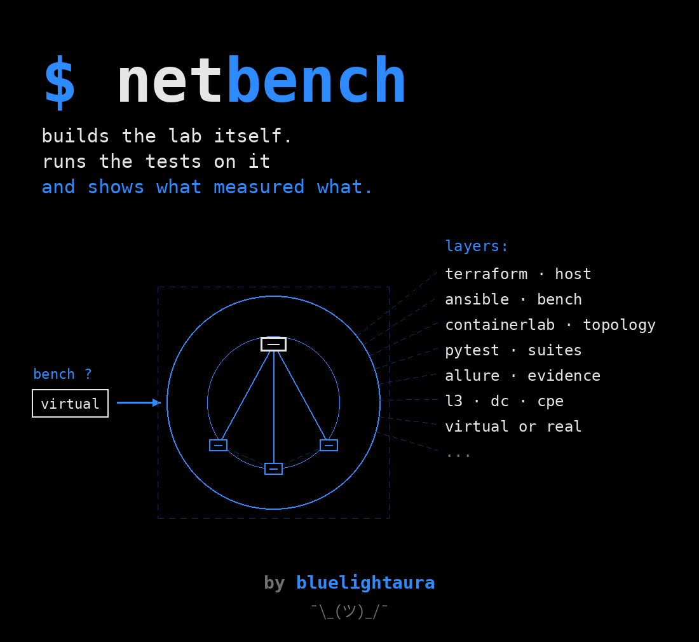

# NetBench



[](https://github.com/bluelightaura/netbench/actions/workflows/ci.yml)
[](https://bluelightaura.github.io/netbench/)

[English version](README.md)

Автотесты сетевого оборудования на виртуальном стенде: инфраструктура, тесты,
CI и отчёт — четырьмя слоями, каждый проверяется отдельно.

Железо для такой проверки обычно и есть то, чего нет. Здесь оно поднимается
контейнерами из одного файла топологии, живёт ровно столько, сколько идёт
прогон, и гасится даже если тесты упали.

## Это болванка, и так задумано

Проект написан как **образец архитектуры**, а не как готовый продукт под
конкретную сеть. Брать его стоит так: склонировать, выкинуть чужие топологии и
профили, положить свои — и получить рабочий стенд, не проектируя слои заново.

Что в нём уже решено за вас:

* **разделение на слои**, в котором каждый проверяется отдельно и заменяется
  целиком: не нравится containerlab — меняется слой 1, тесты не трогаются;
* **разделение «данные против кода»**: различия железок живут в профилях, а не
  в `if` внутри тестов;
* **стенд как сменная деталь**: виртуальный и настоящий описываются одинаково,
  и набор не знает, с чем работает;
* **три пайплайна** на один и тот же набор — видно, что он не прибит к одной
  системе CI;
* **отчёт как часть набора**, а не как приделанный сбоку артефакт.

Что заведомо придётся переписать: топологии, профили, стартовые конфигурации
узлов и сами проверки. Их тут ровно столько, чтобы конструкция была видна.

Образец теста со всеми соглашениями — `suites/_template.py`.

## Адреса в репозитории

В конфигурациях узлов стоят адреса из `192.0.2.0/24` — это диапазон,
зарезервированный под документацию (RFC 5737). Он не маршрутизируется в
интернете и не может совпасть с живой сетью.

Больше адресов в репозитории нет нигде, включая образец настоящего стенда:
там имена из домена `example.net`. Описания настоящих стендов закрыты
`.gitignore` (`lab/benches/*.local.yml`), паролей нет ни в одном файле —
только имена переменных окружения.

Это не пожелание, а проверяемое правило: `tests/test_hygiene.py` роняет
прогон, если в репозитории появится адрес вне документационных диапазонов,
записанный пароль или описание настоящего стенда.

## Слои

| | что делает | чем |
|---|---|---|
| 0 · машина | создаёт хост, на котором всё живёт | Terraform (libvirt) |
| 1 · инфраструктура | ставит окружение и поднимает топологию | Ansible, containerlab, FRRouting |
| 2 · тесты | ходит на узлы по SSH и проверяет поверхность CLI | pytest, netmiko |
| 3 · CI | собирает образ, поднимает стенд, гоняет, гасит | Actions · Jenkins · GitLab |
| 4 · отчёт | показывает, что именно проверялось и чем | Allure на GitHub Pages |

## Быстрый старт

```sh
pip install -e '.[test]'
pytest tests                        # каркас: без стенда, полсекунды

make -C lab up                      # поднять виртуальный стенд
pytest                              # прогнать всё
make -C lab down
```

`pytest tests` гоняется где угодно и ничего не поднимает: он проверяет сам
каркас — что описания стендов, топологий и профилей сходятся, что выгрузка
даёт инструментам то, что они ждут, и что в репозитории нет лишнего. Это то,
что в CI отрабатывает за полминуты и ловит опечатку до того, как на неё
потратят десять минут подъёма стенда.

Другая железка — другой стенд, тот же набор:

```sh
make -C lab up TOPO=dc-fabric       # ЦОД: спайн и два листа
pytest --bench virtual-dc

make -C lab up TOPO=cpe-sdwan       # CPE в SD-WAN
pytest --bench virtual-cpe

pytest --bench real.local --apply   # настоящие железки
```

## Железо — виртуальное или настоящее

Слой 1 не прибит к containerlab. Стенд описывается файлом, и их два вида:

```yaml
# lab/benches/virtual-l3.yml — поднимается сам, живёт один прогон
kind: virtual
topology: l3-switches
```
```yaml
# lab/benches/real.local.yml — железки уже стоят, к ним подключаются
kind: real
nodes:
  cpe1: {address: cpe1.example.net, profile: cpe-generic}
```

```sh
pytest --bench virtual-l3          # виртуальный стенд
pytest --bench real.local --apply  # настоящие железки
```

Описания настоящих стендов закрыты `.gitignore` (`*.local.yml`): в них адреса и
логины. В репозитории лежит только `real.example.yml`. Паролей нет нигде —
`BENCH_PASSWORD` или `BENCH_PASSWORD_<УЗЕЛ>` для разных железок.

**Настоящая железка защищена отдельно.** Тест, помеченный `changes_config`, на
виртуальном стенде идёт всегда, а на живой железке пропускается, пока не
добавлен `--apply`. За чужой конфигурацией стоит чей-то сервис, и случайно
трогать её прогон не должен.

## Откуда берётся машина

У каждого инструмента здесь ровно одна работа, и это не ради красоты:

```
Terraform    создаёт хост
Ansible      делает из хоста стенд
containerlab поднимает топологию
pytest       проверяет
```

Топологию стенда Terraform не описывает — её поднимает containerlab, и тащить
её в оба места значило бы держать одно и то же дважды.

```sh
cd infra && terraform init && terraform apply
terraform output ansible_line >> ../lab/provision/inventory.ini
```

Провайдер по умолчанию — **libvirt**: локальный KVM, без облачного счёта и без
ключей в репозитории, и `apply` действительно отрабатывает. Облачный вариант
лежит рядом как `cloud.tf.example` — ему нужны свои секреты, а план, который
никто не может применить, доказывает меньше локальной машины, которая встаёт.

Состояние Terraform закрыто `.gitignore`: в нём адреса и всё, что создано.

Если машина уже есть — слой 0 просто не нужен, `inventory.ini` правится рукой.

## Развернуть на голой машине

Один плейбук доводит хост от «ничего нет» до «pytest проходит»:

```sh
make -C lab deploy                  # Docker, containerlab, venv, образ узла, Allure
make -C lab deploy-no-allure        # без JVM: она нужна отчёту, не тестам
```

Четыре роли, разделённые по тому, что каждая ставит, а не по порядку:

| роль | зачем |
|---|---|
| `docker` | узлы стенда — контейнеры |
| `containerlab` | поднимает топологию из одного файла |
| `bench` | venv, зависимости проекта, образ узла |
| `allure` | JRE и Allure CLI — только для отчёта, пропускается тегом |

Разворачивать можно и не сюда: в `inventory.ini` по умолчанию `localhost`, но
дописать свой раннер или ВМ — одна строка.

## Подготовка настоящих железок

Виртуальный стенд разворачивает containerlab: конфигурации монтируются в узлы
при старте. А настоящая железка уже стоит и помнит чужие правки — её надо
привести к известному состоянию:

```sh
make -C lab devices-baseline BENCH=real.local   # снять «до», применить базовую
make -C lab devices-restore  BENCH=real.local   # вернуть как было
```

Инвентарь для этого **не отдельный файл, а тот же описатель стенда**:
`lab/provision/inventory.py` читает `lab/benches/<имя>.yml` и раздаёт узлы
группами по классу железки. Иначе адреса жили бы в двух местах и разошлись.

## Как держится универсальность

Железки разные, разговор с ними один. Различия вынесены в данные, а не
разложены по коду.

**Профиль** (`lab/profiles/*.yml`) описывает, чем железка отличается:
приглашение, вход в конфигурацию, чем ругается, что меняется в выводе само —
и какие команды набирать.

Тест просит понятие, профиль даёт команду:

```python
# в тесте — ни одной вендорской строки
session(name).send_command(cmd(name, "version"))
```
```yaml
# lab/profiles/l3-switch.yml
commands:
  version:        show version
  running_config: show running-config
  interface:      show interface {iface}
  neighbors:      show ip ospf neighbor
  bogus:          definitely-not-a-command
```

У другого вендора те же понятия называются иначе — и меняется только профиль.
Нет понятия в профиле (железка такого не умеет) — тест пропускается с
объяснением, а не падает.

Та же идея, что в инвентаре CLIRunner: профилей вендоров нет, есть ключи.

**Умения.** Профиль перечисляет, что железка умеет, набор — что ему нужно:

```python
pytestmark = [pytest.mark.lab, pytest.mark.needs("sdwan")]
```

| профиль | умения |
|---|---|
| `l3-switch` | cli, config, l2, routing |
| `dc-fabric` | cli, config, l2, l3, routing, evpn, vxlan |
| `cpe-generic` | cli, config, sdwan, tunnels, bfd |

Чего стенд не объявил — пропускается с объяснением, а не падает красным. Один
`suites/common` гоняется везде; `l2`, `dc`, `sdwan` просыпаются там, где уместны.
Новый класс железок — это топология и профиль, тесты не трогаются.

## Куда писать тесты

В `suites/`. Папка выбирается по тому, какой железке тест адресован:

| папка | о чём | просыпается на |
|---|---|---|
| `common/` | любая железка с CLI | всех |
| `l2/` | коммутация: влан, транк, таблица MAC | `l3-switch`, `dc-fabric` |
| `dc/` | ЦОД: evpn, vxlan, фабрика | `dc-fabric` |
| `sdwan/` | туннели, bfd, политика | `cpe-generic` |

Папка — для людей. Что реально выполнится, решают метки:

```python
pytestmark = [pytest.mark.lab, pytest.mark.regress, pytest.mark.needs("sdwan")]
```

Нет умения в профиле стенда — тест пропускается с объяснением, а не падает
красным. Новый класс железок — новая папка, настраивать ничего не надо.

Образец со всеми соглашениями: `suites/_template.py` (pytest его не собирает,
имя не начинается с `test_`). Скопировать, переименовать в `test_<о чём>.py`,
править.

```sh
pytest -m smoke                     # только дым
pytest -m "regress and not slow"
pytest suites/sdwan                 # одна папка
```

## Тесткейсы

Отдельного документа с тесткейсами здесь нет намеренно. Он разойдётся с кодом —
через месяц будет две версии правды, и никто не скажет, какая настоящая.

Тесткейс живёт в самом тесте, аннотациями Allure, и отчёт собирает из них
читаемую карточку: эпик, фича, история, важность, предусловие, шаги, ожидание.
Рядом — транскрипт того, что реально ушло на железку.

```python
@allure.epic("Сетевое оборудование")
@allure.feature("Поверхность CLI")
@allure.severity(allure.severity_level.CRITICAL)
@allure.description("Предусловие… Шаги… Ожидается…")
# @allure.testcase("https://tms.example.com/case/123", "TMS-123")
```

Если есть система управления тестами — связываются номером через
`allure.testcase`. Дублируется только идентификатор, а он не протухает.

## Подключить инструменты — опция

Стенд самодостаточен: он проверяет железки и ничего ни о каких инструментах не
знает. Но к нему можно подключить любой инструмент, который ходит по CLI, —
и это **описание, а не код**.

```yaml
# lab/tools/clirunner.yml
name: clirunner
binary: clirunner          # нет в системе — проверки по нему пропускаются
export: clirunner          # в каком виде отдать ему стенд
export_as: inventory.conf

checks:
  - title: Видит железки стенда и достукивается до них
    run: ["-i", "{export}", "status"]
    expect: "доступно"
```

Положить рядом такой же файл — и чужой инструмент подключён, программировать
нечего. `suites/tools/test_tools.py` собирает проверки из всех описаний.

Адреса не дублируются: стенд выгружает себя сам, в формате инструмента.

```sh
python lab/export.py clirunner > inventory.conf
python lab/export.py cliradar
python lab/export.py traphy
```

Для clirunner выходит секция на класс железки с ключами из профиля —
`config_enter`, `config_exit`, `save_cmd`, `prompt`, — чтобы коммутатор не
получил настройки CPE. Для CLIRadar — `config.yml` с `password_env`: пароль
берётся из окружения, а не ложится в файл.

**Зависимости у стенда нет.** Не установлен инструмент — проверка пропускается
с объяснением, как и умение, которого нет у железки. Отсутствие не дефект.

## Метки, фикстуры, флаги

**Метки**

| | |
|---|---|
| `lab` | нужен поднятый стенд |
| `needs(cap)` | набор требует умения из профиля |
| `changes_config` | правит железку; на настоящей нужен `--apply` |
| `smoke` · `regress` · `slow` | уровни |

**Фикстуры**

| | |
|---|---|
| `bench` | узлы стенда: адрес, порт, профиль, умения |
| `one` | `one()` — любой узел, `one("cpe")` — первый с таким началом имени |
| `every` | `every("leaf")` — все узлы с таким началом имени |
| `bench_spec` | описание стенда как есть |
| `is_real` | виртуальный или настоящий |
| `can` | умения стенда целиком |
| `session` | сессия до узла, пишет транскрипт, закрывается всегда |

**Флаги**

| | |
|---|---|
| `--bench ИМЯ` | какой стенд брать (главнее переменной `BENCH`) |
| `--apply` | разрешить правку настоящей железки |
| `--evidence auto\|always\|never` | когда прикладывать транскрипт к отчёту |

## Отчёт

Allure здесь не для красоты. Сессия до узла пишет всё, что ушло и что
вернулось, и транскрипт уезжает вложением к шагу — при падении всегда, с
`--evidence always` и на зелёных.

Каждый прогон дополнительно пишет `environment.properties`: какой стенд, какая
топология, разрешены ли правки. Через неделю отчёт без этого не говорит ничего
о том, против чего его вообще гоняли. `lab/allure/categories.json` разбирает
исходы по категориям, чтобы «стенд не поднялся» не лежало рядом с «железка
ответила не так».

Смысл тот же, что во всех остальных инструментах: «прошло» без доказательства
ничем не отличается от «никто не смотрел».

Генератор Allure требует JVM, поэтому он живёт в слое CI, а не в наборе: сами
тесты зависят только от pytest, netmiko и PyYAML.

## Почему FRRouting

Apache-лицензия, образ тянется без аккаунта, `vtysh` даёт настоящий
Cisco-подобный CLI — ту самую поверхность, об которую спотыкаются инструменты.

cEOS и SR Linux ближе к живым железкам, но требуют регистрации и их образы
нельзя перераспространять. Настоящие IOS и JunOS через vrnetlab нужна
вложенная виртуализация, которой на раннерах GitHub нет. Красивая топология,
падающая через раз, хуже двух узлов, которые встают зелёными всегда.

FRR сам по себе sshd не поднимает, а инструменты ходят по SSH — поэтому образ
собирается свой (`lab/Dockerfile.frr-ssh`). Это первое, что приходится решать
на таком стенде, и решено оно здесь, а не обойдено подменой транспорта.

## Почему три пайплайна

Основной — Actions: только они дают зелёный бейдж и публичную историю прогонов
на той же странице, куда приходит читатель. `Jenkinsfile` и `.gitlab-ci.yml`
рядом гоняют тот же набор, чтобы переносимость CI была видна, а не заявлена.

Каждый из трёх начинается с одного и того же дешёвого шага — линтер и
офлайн-проверки каркаса — до того, как что-то поднимается. Сломанное описание
должно стоить полминуты, а не десяти.

## Что проверяется

Не маршрутизация, а то, что железка отвечает предсказуемо: приглашение,
длинный вывод целиком без обрезки, отказ на неизвестной команде, применение и
откат конфигурации. Это и есть то, что ломается у инструментов, работающих с
CLI, и то, что не проверить на моках.

## Структура

```
infra/                      слой 0
  main.tf                     машина под стенд (libvirt)
  variables.tf  outputs.tf
  cloud.tf.example            облачный вариант, если нужен
lab/                        слой 1
  topologies/               что поднимать
    l3-switches.clab.yml      два коммутатора и линк
    cpe-sdwan.clab.yml        два CPE и контроллер
  profiles/                 чем железки отличаются — данными
    l3-switch.yml
    cpe-generic.yml
  configs/                  стартовые конфигурации узлов
  benches/                  какой стенд брать
    virtual-*.yml             поднимается сам
    real.example.yml          образец для настоящих железок
  provision/                Ansible
    site.yml                  развернуть проект на машине
    inventory.ini             куда разворачивать
    roles/                    docker · containerlab · bench · allure
    inventory.py              инвентарь железок из того же описателя стенда
    devices-baseline.yml      привести железки к известному состоянию
    devices-restore.yml       вернуть как было
  Dockerfile.frr-ssh        FRR + sshd: вход сразу в vtysh
  tools/                    описания инструментов — опция
  export.py                 выгрузить стенд в формате инструмента
  Makefile                  up/down/status для виртуального, baseline/restore для живого
  allure/                   категории дефектов для отчёта
conftest.py                 слой 2: стенд, профили, умения, сессии
tests/                      проверки самого каркаса, без стенда
suites/                     слой 2: сами проверки
  common/                     любая железка с CLI
  tools/                      инструменты против стенда, по описаниям
  l2/                         только где объявлено умение l2
  dc/                         только где объявлено evpn / vxlan
  sdwan/                      только где объявлено sdwan
.github/workflows/ci.yml    слой 3, основной: матрица по топологиям
Jenkinsfile                 слой 3
.gitlab-ci.yml              слой 3
```

## Лицензия

MIT — см. [LICENSE](LICENSE).
